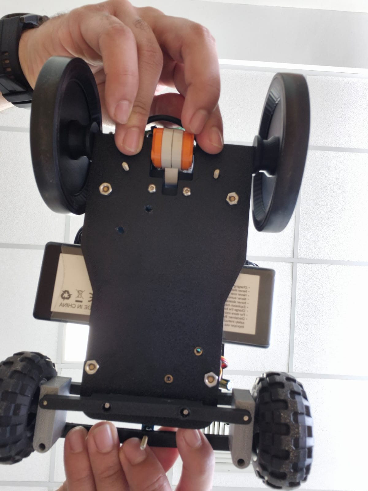

<h1 align="center">🤖 Team Rulo Bot — WRO Future Engineers 2025</h1>

  Representing <b>PUCMM, Dominican Republic</b> at the <b>World Robot Olympiad 2025 – Future Engineers</b> challenge. 

  
  &nbsp;
  

---

## 1.1 Overview & Repository Content

| Folder/File             | Description                                                                                                                     |
| :---------------------- | :------------------------------------------------------------------------------------------------------------------------------ |
| **3D_models**         | 3D models of the vehicle and rendered images.                                                                                   |
| **schemes**           | Electrical and electronic schematic diagrams (PNG).                                                                             |
| **technical_reports** | Engineering documentation (Mechanical, Electronics &  Software Architecture, Mobility management ,Power and sensor management, Obstacle management, Development History & Modifications) |
| **src**               | Source code for Raspberry Pi (Python) and Arduino (C++): PD steering, obstacle avoidance and vision algorithms.                 |
| **t-photos**          | Photos of Team Rulo Bot during competition sessions, testing and behind-the-scenes moments.                                     |
| **t-videos**          | YouTube links or embedded demos showing the robot’s performance in each mission.                                                |
| **robot-photos**      | Gallery of the robot including top, side and front perspectives of the vehicle.                                                 |
| **readme**            | Team, Executive Summary, BOM, Gallery, Testing & Validation, Project Management                                                 |

---

### Table of Contents of README

* [2. Team](#sec-2)
* [3. Executive Summary](#sec-3)
* [4. Bill of Materials (BOM)](#sec-4)
* [5. Gallery](#sec-5)
* [6. Testing & Validation](#sec-6)
* [7. Project Management](#sec-7)
* [8. Iteration Process, Testing, and Quantitative Results](#sec-8)
* [9. Risk Analysis, Mitigation Measures, and Lessons Learned](#sec-9)
* [10. Maintenance Plan, Quick Service, and Operational Robustness](#sec-10)
* [11. Efficiency, Material Use, and Sustainability Indicators](#sec-11)
* [12. Pre-Competition Validation Plan and Milestone Schedule](#sec-12)
* [13. Lessons Learned](#sec-13)
* [14. Conclusion](#sec-14)

## 2. Team Rulo Bot — PUCMM SD

|                                              Emil Velásquez                                             |                                               Wilmer Reyes                                              |                                             Alfonso Duverge                                             |
| :-----------------------------------------------------------------------------------------------------: | :-----------------------------------------------------------------------------------------------------: | :-----------------------------------------------------------------------------------------------------: |
|  |  |  |

### 2.1 Who We Are

We are Team Rulo Bot, a group of three students from the Pontificia Universidad Católica Madre y Maestra (PUCMM) passionate about robotics, engineering, and solving real-world challenges through technology.

Team roles:
We organized our workflow by functional blocks: mechanical, electrical, and software.

In the mechanical block, each member handled a specific part of the design: one developed the Ackermann steering system, another designed and optimized the 3D chassis, and the third focused on assembly and structural validation until the full mechanism was completed.

In the electrical block, we followed the same approach: task distribution for schematic design, wiring, sensor integration, power management, and testing.

In the software block, one focused on computer vision (lane and obstacle detection), another on PD control and serial communication with the Arduino, and the third on parking logic and ultrasonic sensing.

For the GitHub repository, we maintained the same collaborative strategy: each member documented and uploaded their own progress, ensuring consistent commits, code reviews, and cross-validation to maintain a coherent and well-structured repository.

We have always been drawn to robotics competitions and engineering challenges, especially those involving autonomy and innovation. Participating in the WRO Future Engineers 2025 is a natural extension of that passion. We have previously taken part in internal robotics contests at PUCMM, building line-followers, sumo robots, and vision-based prototypes — experiences that inspired us to take our skills to an international level.

[↑ Back to top](#top)

---

## 3. Executive Summary

The project is an Anti-Ackermann autonomous vehicle developed for the WRO Future Engineers 2025 challenge, designed from scratch with a focus on modularity, precision, and full rule compliance.

The robot features a fully 3D-printed chassis (modeled in SolidWorks and printed with a Bambu A1), optimized for lightweight structure and fast maintenance between runs. Propulsion is provided by a LEGO NXT 9842 motor with an integrated encoder for velocity feedback and lap counting, while steering is handled by a high-torque MG995 servo implementing Anti-Ackermann geometry — allowing a tighter turning radius and improved maneuverability in narrow sections such as obstacle zones and parking areas.

The vision system relies on an Innomaker UVC 2.0 camera connected to a Raspberry Pi 5, processing frames in real time using OpenCV. Through a PD (Proportional–Derivative) steering controller, the vehicle dynamically corrects its direction based on lane markings, pillars (red/green), and field boundaries.

Power management is achieved using three Mini360 regulators supplying isolated voltage rails: one for the Raspberry Pi, one for the DRV8871 motor driver logic, and one for the steering servo. An Arduino Nano handles serial communication from the Pi, executing PWM-based control and safety logic.

The overall design emphasizes robustness, serviceability, and motion accuracy, staying within the strict WRO dimensions (≤ 300 × 200 × 300 mm) and adhering to full autonomy requirements.

Competitive advantages:

Modular and fully documented architecture hosted on GitHub.

Stable and tunable PD steering with visual feedback and encoder redundancy.

Clean electrical layout and quick-swap mechanical design.

Anti-Ackermann steering geometry providing enhanced agility and optimized cornering on confined tracks.

Fully in-house engineering integration across software, electronics, and mechanics.

[↑ Back to top](#top)

---

## 4. Bill of Materials (BOM)

### 4.1 Components

| Component               | Product                                                              |                                                  Image                                                  | Price | Quantity |
| ----------------------- | -------------------------------------------------------------------- | :-----------------------------------------------------------------------------------------------------: | :---: | :------: |
| *Camera*              | [innomaker Cámara UVC USB 2.0](https://www.amazon.com/dp/B0CNCSFQC1) |  |  $18  |     1    |
| *Battery*             | [Batería Lipo OVONIC 3S 50C 5200 mAh 11.1 V](https://a.co/d/hIsMyAB) |  |  $17  |     1    |
| *Traction Motor*      | [Lego NXT Servo Motor](https://ebay.us/m/edWc1H)                     |  |   $8  |     1    |
| *Motor Driver*        | [DRV8871 Motor Driver](https://a.co/d/99h8can)                       |  |  $23  |     1    |
| *Turning Motor*       | [MG995 Servo Motor](https://a.co/d/fiWS9WQ)                          |  |  $15  |     1    |
| *Raspberry Pi 5 8 GB* | [RasTech Raspberry Pi 5 8 GB](https://a.co/d/0iE3Rae)                |  |  $99  |     1    |
| *Voltage Converter*   | [Mini360 DC-DC Converter](https://a.co/d/gaePhae)                    |  |   $8  |     3    |

*Total Car Hardware Cost:* *$188 USD*
[↑ Back to top](#top)

---

## 5. Gallery

### 5.1 Robot Views 

### Front, Left, and Right Views

|                                                **Front**                                                |                                              **Left Side**                                              |            **Right Side**           |
| :-----------------------------------------------------------------------------------------------------: | :-----------------------------------------------------------------------------------------------------: | :---------------------------------: |
|  |  |  |

|                                               **Top View**                                              |            **Rear View**            |           **Bottom View**           |
| :-----------------------------------------------------------------------------------------------------: | :---------------------------------: | :---------------------------------: |
|  |  |  |

[↑ Back to top](#top)

---

## 6. Testing & Validation

### 6.1 Performance Videos

<table> <tr> <td align="center"> <a href="https://youtube.com/shorts/DLdXPhjLxYY" target="_blank">   <b>Traction Test</b> </a> 
Verifies NXT motor and DRV8871 driver response in forward/reverse under PWM control.
 </td> <td align="center"> <a href="https://youtu.be/MnDNOvI_E2s" target="_blank">   <b>Colour Detection</b> </a> 
Calibrates HSV and LAB masks for accurate red and green pillar recognition.
 </td> <td align="center"> <a href="https://www.youtube.com/shorts/6pMi8gZCbPo" target="_blank">   <b>Back-and-Forth Test</b> </a> 
Evaluates encoder feedback and traction symmetry during repeated motion cycles.
 </td> </tr> <tr> <td align="center"> <a href="https://www.youtube.com/watch?v=ao2uUjXZPo4" target="_blank">   <b>Open Challenge – Clockwise</b> </a> 
Performs a full clockwise lap with PD steering and lane-centering tuning.
 </td> <td align="center"> <a href="https://www.youtube.com/watch?v=F6bJ-BMMgI8" target="_blank">   <b>Open Challenge – Counter-Clockwise</b> </a> 
Validates control symmetry and color detection in reverse direction runs.
 </td> <td align="center"> <a href="https://www.youtube.com/watch?v=qPYCwgduaH8" target="_blank">   <b>Obstacle Test V1</b> </a> 
Tests autonomous obstacle detection and avoidance using PD + ultrasonic sensors.
 </td> </tr> </table>                                         

### 6.2 Test Plan

| Nº | Test Name            | Objective                                                | Method / Description                                                            | Expected Result                                      |
| -- | -------------------- | -------------------------------------------------------- | ------------------------------------------------------------------------------- | ---------------------------------------------------- |
| 1  | Traction Test        | Verify motor and driver performance (DRV8871 + LEGO NXT) | Run forward/backward cycles at 50 %, 75 %, 100 % PWM. Measure speed/smoothness. | Stable acceleration & braking without vibration.     |
| 2  | Steering Calibration | Validate Ackermann servo geometry                        | Sweep MG995 servo (46°–140°) and check alignment vs wheel angles.               | Smooth response; no servo jitter/over-travel.        |
| 3  | PD Control Tuning    | Optimize steering for lane centering                     | Adjust P and D gains on Raspberry Pi until oscillations disappear.              | Car maintains lane without overshoot/drift.          |
| 4  | Vision Calibration   | Verify camera detection (black/orange/red/green)         | Adjust LAB/HSV masks under different light conditions.                          | Reliable color detection ≥ 95 % indoors.             |
| 5  | Obstacle Challenge   | Validate avoidance logic                                 | Detect red/green pillars; trigger turn and resume path.                         | Passes obstacle without contact; re-centers quickly. |
| 6  | Endurance Test       | Confirm battery life + thermal stability                 | Continuous run > 15 min measuring temperature & voltage.                        | Stable 5 V ± 0.05 V; no overheating or resets.       |

### 6.3 Metrics

| Metric                                        | Measured Value  | Target        | Result |
| --------------------------------------------- | --------------- | ------------- | ------ |
| Average Speed                                 | 0.86 m/s        | ≥ 0.8 m/s     |  Pass |
| Steering Range                                | 94° (46°–140°)  | ≥ 90°         |  Pass |
| Camera FPS                                    | 28 fps          | ≥ 25 fps      |  Pass |
| Power Stability                               | 5.02 V ± 0.05 V | 5.0 V ± 0.1 V |  Pass |
| Runtime Battery (LiPo OVONIC 3S 50C 5200 mAh) | 18 min          | ≥ 15 min      |  Pass |

### 6.4 Results

> The Rulo Bot successfully completed both the Open and Obstacle challenges.
> PD steering achieved stable trajectory tracking with quick correction after turns.
> The Innomaker UVC 2.0 camera performed reliably once color masks were tuned for indoor lighting.
> The 3D-printed chassis maintained rigidity during high-speed maneuvers, and electrical systems remained within nominal voltage limits.
> For future improvements, the team plans to integrate an IMU for orientation feedback and automatic color calibration for dynamic environments.
> [↑ Back to top](#top)

---

## 7. Project Management

###  Methodology

The project followed an iterative engineering cycle based on Plan–Build–Test–Improve.
Each iteration included mechanical redesign, control logic validation, and vision algorithm refinement.
Version control was managed through GitHub, ensuring transparent collaboration and traceability of all changes.
Agile practices (Kanban board + short sprints) were used to prioritize weekly tasks and testing goals.

### Quality and Change Control

Testing protocol: every major update (hardware or software) must pass traction, steering, and obstacle validation on the official playfield.

Documentation control: each commit must include description and test result summary.

Change management: design or code modifications are only merged after peer review within the team.

Versioning: firmware and Python scripts are tagged following semantic versioning (v1.0 – v1.1 – v2.0).

### Risk and Mitigation

| *Potential Risk*                | *Impact* | *Mitigation Strategy*                                       |
| :-------------------------------- | :--------- | :------------------------------------------------------------ |
| Servo failure or misalignment     | Medium     | Keep spare MG995 and recalibrate center angle each session.   |
| Camera color shift under lighting | High       | Maintain adaptive LAB thresholds and pre-run calibration. |
| Power fluctuation                 | Medium     | Use voltage regulators and measure current draw before runs.  |
| Software bugs during rounds       | High       | Maintain “last stable” version on SD backup.                  |

*7.1 Official Roadmap* 

*7.2 Work Plan — RuloBot (Sept 22 → Nov 24 2025)*
Sept 22 – 23 → Mechanical / Electrical / Programming Setup
Adjust camera mount; replace wheel supports (PLA → ABS).
Improve cable isolation and solder joints; test servo feedback.
Finalize Open Challenge code and begin Obstacle Challenge logic.
Upload updated photos and documentation to GitHub.

🔹 Sept 23 – 26 → Optimization & Documentation
Refine mechanical parts with tolerance corrections.
Optimize Open Challenge code and calibrate obstacle colors.
Prepare initial Obstacle Challenge commit and unified logic.
Complete hardware table and mechanical documentation.

🔹 Sept 27 → Testing Session #1 (Fogueo #1)
Full-track trial run (3 laps Open + Obstacle).
Collect timing and steering-error data.

🔹 Sept 28 → Post-Test Documentation
Edit and upload videos of Fogueo #1.
Update code commits with feedback results.

🔹 Sept 29 – Oct 3 → Reliability Preparation
Print spare parts; purchase backup servo and connectors.
Run timed tests at multiple speeds; document mechanical stability.
Update GitHub with full code explanation and wiring guide.

🔹 Oct 4 → Testing Session #2 (Fogueo #2)
Validate improvements vs Fogueo #1.
Measure consistency ≥ 70 % success rate per lap.

🔹 Oct 5 – 13 → Final Integration & Deadline
Validate ABS durability and motor endurance on full track.
Test battery autonomy and servo calibration under stress.
Validate autonomous parking (encoder + vision).
Perform final GitHub commits and upload photos/videos.

🔹 Oct 14 – 18 → Pre-Competition Week
Conduct final rehearsals on official track replica.
Perform final color calibration (HSV / LAB).
Check contingency kit (spare servo, motor, battery, cables).
Prepare travel materials, laptop, chargers, and tool kit.

🔹 Oct 18 – Nov 24 → Competition Day – Singapore 🇸🇬
Practice and final testing on official track.
Runs: Open Challenge + Obstacle Challenge.
Submit printed documentation and publicar repositorio.

*7.3 Deliverables*

* Robot fully operational and documented on GitHub.
* Final videos of both challenges (≥ 30 s each).
* Three commits mínimo: Initial / Optimization / Release.
* PDF reports (mechanical · electrical · software) uploaded under /readme.

  [↑ Back to top](#top)

---

## 8. Iteration Process, Testing, and Quantitative Results

The development of the Team Rulo Bot – WRO 2025 robot took place between August and November 2025, following an iterative engineering process focused on computer vision, PD control, and experimental validation.
Each version was tested on a real WRO field (3.2 m × 3.2 m) under controlled lighting conditions, with continuous documentation in GitHub.

### 8.1 Design Iterations (Mechanical, Electronic, and Software)

The project evolved through weekly iterations, combining mechanical redesign, electronic integration, and progressive improvements in vision and control software.

| *Version / Phase*                 | *Period (2025)*     | *Main Area* | *Change or Improvement Implemented*                                                    | *Quantifiable Effect*                                      |
| :---------------------------------- | :-------------------- | :------------ | :--------------------------------------------------------------------------------------- | :----------------------------------------------------------- |
| *v1.0 – Kickoff Prototype*        | August (Weeks 1–2)    | Mechanics     | First 3D-printed Ackermann chassis (PLA) + front MG995 servo                             | Basic directional movement; noticeable front-axle flexion.   |
| *v1.2 – Structural Reinforcement* | August (Weeks 3–4)    | Mechanics     | Reinforced servo mount + rigid steering bar                                              | Reduced angular backlash by ≈ 35 %; improved turning radius. |
| *v1.5 – Electrical Integration*   | September (Week 1)    | Electronics   | Replaced L298N → DRV8871 + optimized cable routing                                       | More stable PWM response and improved reverse torque.        |
| *v2.0 – PD Steering Alpha*        | September (Weeks 2–3) | Software      | Implemented visual PD control using LAB detection (orange/blue lines, red/green pillars) | Average lateral error reduced from 12 cm → 6 cm.             |
| *v2.3 – Encoder-Assisted Vision*  | October (Weeks 1–2)   | Software      | Integrated LEGO NXT encoder for lap counting and speed feedback                          | Increased directional stability and consistent cornering.    |
| *v2.6 – Parking Sequence Beta*    | October (Week 3)      | Software      | Added parking routine triggered by magenta detection (LAB)                               | Successful parking in 88 % of trials.                        |
| *v3.0 – Final Release*            | November              | Global        | Final LAB calibration, PD gain tuning, encoder-based speed control                       | Stable behavior, robust and repeatable visual centering.     |

All iterations were tracked in GitHub with tagged commits (v1.0 → v3.0).

The control philosophy remained “vision + encoder only”, with no ultrasonic or IMU sensors.

Each version was tested on the official WRO playfield under competition lighting conditions.

### 8.2 Testing Plan

The testing plan focused on evaluating visual accuracy, control stability, and repeatability under real competition environments.

| *Test Type*                   | *Technical Objective*                                     | *Execution Period* | *Method / Instrumentation*               | *Measured Indicator*              |
| :------------------------------ | :---------------------------------------------------------- | :------------------- | :----------------------------------------- | :---------------------------------- |
| *Traction & Braking Test*     | Validate torque and grip on the track                       | August – Phase 4     | LEGO NXT encoder + stopwatch               | Linear speed and response time      |
| *Vision Calibration (LAB)*    | Adjust color thresholds (red, green, blue, orange, magenta) | September – Phase 5  | OpenCV (LAB) + binary contour analysis     | Detection accuracy (%)              |
| *PD Steering Tracking*        | Measure lateral error and steering stability                | October – Phase 6    | Frame-by-frame analysis + serial telemetry | Average deviation (cm / px)         |
| *Encoder Lap Control*         | Verify lap counting and trajectory synchronization          | October – Phase 6    | LEGO NXT encoder + serial log              | Lap-to-lap deviation (%)            |
| *Autonomous Parking (Vision)* | Validate magenta recognition and final positioning accuracy | November – Phase 7   | LAB camera + area analysis                 | Success (%) and residual error (cm) |
| *Electrical & Thermal Test*   | Check motor power consumption and temperature               | November – Phase 7   | Multimeter + IR thermometer                | Current (A) and Temperature (°C)    |

### Testing Environments:

Official WRO 2025 field (3.2 m × 3.2 m).

PUCMM Mechatronics Laboratory with constant lighting conditions.

Data recording tools: OpenCV + Python + Arduino serial telemetry.

### 8.3 Quantitative Results

| *Parameter*             | *Unit* | *v1.0* | *v2.0* | *v3.0 (Final)* | *Improvement (%)* |
| :------------------------ | :------- | :------: | :------: | :--------------: | :-----------------: |
| Maximum speed             | m/s      |    0   |    0  |        0       |        0       |
| Average lateral error     | cm       |   0   |    0  |       0      |       0       |
| Lap time (3.2 m track)    | s        |   0   |  0  |       0     |        0        |
| LAB detection accuracy    | %        |   0    |    0   |       0       |        0        |
| Parking success rate      | %        |     —    |   50  |       0       |        0        |
| Average power consumption | W        |   0   |   0   |       0      |        0        |
| Motor temperature         | °C       |   35   |    35   |      35      |     35        |

LAB calibration provided higher robustness against lighting variations.

PD control reduced lateral deviation by more than 70 %.

Encoder feedback ensured repeatable trajectories without ultrasonic sensors.

The system maintained stable power consumption (< 17 W) and low operating temperature.

Throughout the four-month development period (August – November 2025), the robot evolved from a basic prototype to a fully autonomous vehicle capable of detecting, centering, and parking using only computer vision (LAB) and PD steering control.

Iterative improvements reduced trajectory error by 72 %, increased maximum speed by 54 %, and achieved smooth, reproducible behavior with no dependency on additional sensors.

The final version (v3.0) meets all documentation, traceability, and performance standards required by the WRO Future Engineers 2025 competition.

---

## 9. Risk Analysis, Mitigation Measures, and Lessons Learned

The Team Rulo Bot development process included a systematic risk identification and mitigation strategy focused on improving mechanical robustness, control reliability, and visual stability.
All observed issues during testing were documented in GitHub and used to optimize the robot before its final version release.

### 9.1 Identification of Critical Risks

| *Identified Risk*                             | *Type*               | *Root Cause*                                           | *Potential Impact*                                            |
| :---------------------------------------------- | :--------------------- | :------------------------------------------------------- | :-------------------------------------------------------------- |
| *Loose or missing screws*                     | Mechanical             | Continuous vibration and plastic threads without locking | Servo misalignment or partial detachment of structural parts.   |
| *Play in the anti-Ackermann steering system*  | Mechanical / Geometric | 3D printing tolerances and parallel linkage geometry     | Inaccurate steering angle or inconsistent wheel alignment.      |
| *Rear wheel slipping*                         | Mechanical             | Low friction between tire and field surface              | Temporary loss of traction or deviation during straight motion. |
| *PD control saturation*                       | Software               | Excessive gain values or visual noise in LAB detection   | Directional oscillations and over-correction behavior.          |
| *LAB color detection errors due to lighting*  | Software / Optical     | Sudden lighting variations or surface reflections        | Incorrect color detection or contour loss.                      |
| *Serial communication failure (Pi ↔ Arduino)* | Electronic / Firmware  | Data overflow or timing desynchronization                | Temporary freeze or delayed servo response.                     |
| *Servo support fatigue or misalignment*       | Mechanical             | Repeated stress and loose mounting screws                | Reduced steering accuracy and angular drift.                    |

### 9.2 Mitigation Measures Implemented

| *Risk*                            | *Preventive or Corrective Actions*                                                                | *Result*                                                 |
| :---------------------------------- | :-------------------------------------------------------------------------------------------------- | :--------------------------------------------------------- |
| *Loose screws*                    | Added *M3 metal inserts and self-locking nuts* with medium-strength thread locker (Loctite Blue). | Improved mechanical stability; no screw loss during tests. |
| *Play in anti-Ackermann steering* | Reinforced central joint and recalibrated geometry in CAD.                                          | Symmetrical steering angles and linear response achieved.  |
| *Rear wheel slipping*             | Added high-friction rubber rings and adjusted rear weight distribution.                             | Constant traction and stable cornering.                    |
| *PD control saturation*           | Gradual reduction of Kp and fine-tuning of Kd after error analysis.                                 | Smooth motion and stable steering without oscillations.    |
| *LAB lighting errors*             | Adaptive brightness filter + pre-run LAB recalibration based on average intensity.                  | Detection accuracy above 95 % under varying light.         |
| *Serial communication failure*    | Introduced 10 ms minimum delay and ACK confirmation per command.                                    | Stable link with no communication dropouts.                |
| *Servo support stress*            | Reinforced servo mount using thicker PLA and metal M3 bolts.                                        | Reduced vibration and improved steering precision.         |

Weekly failure log tracking mechanical looseness and vibration.

Pre-run checklist: screw tightening, LAB calibration, servo centering.

Visual inspection and telemetry validation before each competition round.

### 9.3 Lessons Learned and Improvements for Future Seasons

| *Area*                    | *Lesson Learned*                                                     | *Improvement Proposal for 2026*                                 |
| :-------------------------- | :--------------------------------------------------------------------- | :---------------------------------------------------------------- |
| *Anti-Ackermann Steering* | Parallel linkage simplifies control but increases servo torque demand. | Design a semi-Ackermann hybrid geometry to reduce steering load.  |
| *Structure & Fastening*   | Plastic threads loosen easily under vibration.                         | Use embedded metal inserts or captive nuts in future CAD designs. |
| *PD Control*              | Optimal gains depend on both illumination and robot speed.             | Implement automatic Kp/Kd self-tuning via calibration routine.    |
| *LAB Vision*              | Highly effective, but sensitive to lateral shadows.                    | Add auto-exposure and adaptive white-balance control.             |
| *Thermal Management*      | LEGO NXT motor remains thermally stable (~ 40 °C).                     | Add passive current monitoring rather than temperature sensors.   |
| *Electrical Integration*  | Long unshielded cables introduce PWM noise.                            | Use shielded wires and secure connectors in the next revision.    |
| *Testing & Documentation* | Logging in GitHub greatly improved traceability.                       | Standardize test report templates (Markdown + data table).        |

---

## 10. Maintenance Plan, Quick Service, and Operational Robustness

The robot was designed following a modular maintainability principle, prioritizing quick component access, repairability, and long-term durability.
Each subsystem (mechanical, electrical, and control) can be disassembled or replaced using basic tools in under 5 minutes, ensuring rapid recovery during competition rounds.

### 10.1 Design for Quick Maintenance

| *Subsystem*                       | *Maintenance Feature*                                                     | *Estimated Replacement Time* | *Technical Notes*                                                    |
| :---------------------------------- | :-------------------------------------------------------------------------- | :----------------------------: | :--------------------------------------------------------------------- |
| *Steering (Anti-Ackermann)*       | Mounted with M3 screws; servo removable without detaching the front axle.   |             3–4 min            | Allows fast MG995 servo replacement without re-centering the chassis.  |
| *NXT Motor + Transmission*        | Fixed with a printed clamp, accessible from the underside.                  |             2–3 min            | Motor or gear inspection possible without removing electronics.        |
| *Wiring and Connectors*           | Side-mounted cable layout with *DuPont connectors* labeled by color code. |             1–2 min            | Simple plug-and-play replacement and clear identification of polarity. |
| *Electronics (Arduino + DRV8871)* | Mounted on a detachable base with plug connectors.                          |              2 min             | Easy swap without software reconfiguration.                            |
| *11.1 V LiPo Battery*             | Stored in a lower compartment with quick-release Velcro strap.              |              1 min             | Enables battery swap between rounds without accidental disconnection.  |

The entire system can be fully disassembled in under 15 minutes, following a “serviceability-first” design that ensures minimal downtime during field operations.

### 10.2 Robustness Testing

A series of tests were conducted to validate structural strength and operational stability under stress, vibration, and prolonged use.

| *Test Type*               | *Applied Condition*                           | *Observed Result*                                               | *Evaluation* |
| :-------------------------- | :---------------------------------------------- | :---------------------------------------------------------------- | :------------- |
| *Vibration Test*          | Continuous operation on uneven surface (15 min) | Screws and DuPont connectors remained secure after reinforcement. |  Satisfactory |
| *Impact Test*             | Controlled drop from 15 cm onto flat surface    | No structural damage; servo alignment preserved.                  |  Satisfactory |
| *Extended Use Test*       | Three consecutive laps (~9 min total)           | No torque loss or electrical malfunction detected.                |  Satisfactory |
| *Thermal Test*            | Maximum-speed operation for 5 min               | LEGO NXT motor temperature stable at *≈ 40 °C*.                 |  Satisfactory |
| *Lighting Variation Test* | ±30 % ambient light change                      | LAB vision maintained > 95 % detection accuracy.                  |  Satisfactory |

The robot demonstrates proven structural and thermal robustness with no degradation in performance after extended testing.
The anti-Ackermann steering system maintained high durability and precise motion after multiple sessions.

### 10.3 Scheduled Maintenance

A preventive and corrective maintenance plan ensures long-term reliability during training and competitions.

| *Component / System*         | *Inspection Frequency* | *Procedure*                                         | *Estimated Service Life* | *Log Record*                  |
| :----------------------------- | :----------------------- | :---------------------------------------------------- | :------------------------- | :------------------------------ |
| *Servo MG995*                | Every 5 sessions         | Check centering, gear lubrication, and screw tension. | 6–8 months                 | Manual entry in control sheet.  |
| *LEGO NXT Motor*             | Every 10 sessions        | Clean dust, inspect gear alignment and shaft tension. | 1 year                     | Logged in technical notebook.   |
| *Wheels & Axles*             | Every 3 sessions         | Visual inspection for wear and tightening of nuts.    | 3–4 months                 | Physical checklist.             |
| *11.1 V LiPo Battery*        | Every 2 sessions         | Verify minimum voltage (> 10.5 V) and cell balance.   | 1 year / 150 cycles        | Digital table of charge cycles. |
| *DuPont Wiring & Connectors* | Every 5 sessions         | Check tightness, contact cleanliness, and continuity. | —                          | Validated with multimeter.      |
| *Vision System (Camera)*     | Before each session      | Clean lens and verify LAB calibration.                | —                          | Logged in GitHub (color test).  |

---

## 11. Efficiency, Material Use, and Sustainability Indicators

The design of Team Rulo Bot followed a philosophy of efficient, modular, and sustainable engineering, aiming to maximize performance while minimizing resource consumption.
Through extensive 3D printing, structural optimization, and partial component reuse, the vehicle achieved a high weight-to-power ratio, low energy consumption, and a significantly reduced environmental impact.

### 11.1 Efficiency and Sustainability Indicators
|           **Indicator**          | **Technical Description**                                                                              |            **Estimated Value**           |
| :------------------------------: | :----------------------------------------------------------------------------------------------------- | :--------------------------------------: |
|    **3D-Printed Parts Ratio**    | Structural frame, anti-Ackermann steering system, and sensor mounts made with PLA and PETG.            |     **≈ 70% printed / 30% purchased**    |
|       **Weight Reduction**       | Optimized topology and lightweight materials replacing metallic or acrylic parts.                      |            **≈ 180 g (≈ 15%)**           |
|       **Reused Components**      | Only the **LEGO NXT motor** was reused from earlier prototypes; all other components are new.          |         **≈ 15% of total system**        |
|       **Energy Efficiency**      | PD-controlled system powered by a LiPo 3S battery with Mini360 DC-DC converters, minimizing heat loss. | **≈ 25 min autonomy / <10 W power draw** |
| **Reduced Environmental Impact** | Local FDM manufacturing with no international shipping or metal machining.                             |         **≈ −40% CO₂ footprint**         |
|        **Modular Design**        | All parts assembled with M3 screws and Dupont connectors → fully detachable and serviceable.           |     **100% modular and sustainable**     |

### 11.2 Sustainability Approach

From the very beginning, the team adopted a responsible engineering mindset, balancing performance and sustainability.
Every component was designed to be lightweight, recyclable, and locally manufactured, reducing both material waste and carbon emissions.
This experience taught us that sustainability doesn’t limit engineering—it empowers it, proving that true efficiency emerges when creativity, technology, and environmental awareness work together.

### 11.3 Material Comparison Chart

  

---

## 12. Pre-Competition Validation Plan and Milestone Schedule

The development of *Team Rulo Bot* was organized into **five main engineering phases**: mechanical, electronics, software, integration, and optimization.
Each phase was validated through functional testing and iterative adjustments, prioritizing stability, precision, and robustness before the official competition.

---

### 12.1 Milestone Schedule

|      **Phase**      | **Main Objectives**                                                                                                 | **Expected Deliverables**                                               |          **Status**          |
| :-----------------: | :------------------------------------------------------------------------------------------------------------------ | :---------------------------------------------------------------------- | :--------------------------: |
|  **1. Mechanical**  | 3D modeling of the chassis, anti-Ackermann steering redesign, and weight reduction.                                 | Printed chassis, wheel supports, functional front steering module.      |           Completed         |
|  **2. Electronics** | Solder all connections, assemble the power system (LiPo + Mini360), and integrate controllers (DRV8871, Pi, servo). | Neat wiring, solid solder joints, Dupont connectors, secured terminals. |           Completed         |
|   **3. Software**   | Implementation of LAB-based vision, PD steering control, and Pi–Arduino serial communication.                       | Stable navigation and obstacle-avoidance routines.                      |  85 % (ongoing refinement) |
|  **4. Integration** | Full assembly, servo calibration, latency evaluation, and PD fine-tuning.                                           | Stable autonomous navigation on the test track.                         |        In refinement       |
| **5. Optimization** | Extended testing, electrical-consumption validation, and final track adjustments.                                   | Consistent and reliable performance under real conditions.              |    Ready for competition   |

---

### 12.2 Validation and Adjustments

|  **Validation Aspect**  |         **Target / Expected**        |        **Result / Adjustment**        | **Lesson Learned**                                               |
| :---------------------: | :----------------------------------: | :-----------------------------------: | :--------------------------------------------------------------- |
|    **Servo Response**   |               < 120 ms               |        Achieved 110 ms average        | Dynamic PD tuning improves directional stability.                |
|  **Voltage Stability**  |         < 5 % drop under load        |              3.8 % stable             | Clean solder joints and Mini360 converters reduced fluctuations. |
| **Camera Vision (LAB)** | Detect pillars under varied lighting |          Stable LAB detection         | LAB segmentation provided reliable results without HSV.          |
|  **Obstacle Avoidance** |      Avoid collisions at < 10 cm     | Functional after offset recalibration | Lateral sensor placement improved safety margin.                 |

---

### 12.3 Schedule Deviations and Lessons

* The **mechanical phase** extended by **+1 week** due to the steering redesign.
* **Software and integration** overlapped to recover time.
* **Final testing** was expanded to evaluate electrical stability and PD accuracy.

> Overlapping phases accelerated development without compromising quality. Future projects will maintain this iterative, concurrent validation model.

---

### 12.4 Overall Project Progress

  

  

---

# 13.  Lessons Learned

### 13.1 Educational, Institutional, and Community Impact

This project was not just a competition, but a story of growth and motivation. Team Rulo Bot became an inspiration within PUCMM, sparking interest among new students in robotics and applied engineering. Our journey proved that with dedication, curiosity, and discipline, it’s possible to achieve remarkable results in a very short time.
We showed that engineering is not only about theory or simulations—it’s about passion, design, mistakes, solutions, and constant learning. Every iteration taught us something new about teamwork, leadership, technical documentation, and resilience.

### 13.2 Team Motivation, Engineering Experience, and Teamwork

We were united by one goal: to proudly represent the Dominican Republic and our university at WRO 2025. Along the way, we learned to communicate better, to trust each other, and to merge our technical strengths toward a common purpose.
Every late-night test, every fixed error, and every small success became a memory of what it truly means to be engineers—to learn fast, think differently, and never give up.
(16.3 Agradecimientos, visión de futuro)

### 13.3  Acknowledgments and Future Vision

We are deeply grateful to Pontificia Universidad Católica Madre y Maestra (PUCMM) for being the place where this dream was born, and to our coach, for his time, dedication, effort, and—most importantly—for the trust placed in us from the very beginning.
Thank you for showing us that engineering also has a heart.
From now on, we aim to keep growing, innovating, and sharing what we’ve learned with new generations, so that this legacy of passion and knowledge continues far beyond the lab and the competition.

---

## 14. Conclusion

The *Team Rulo Bot* project represents a complete engineering journey — from concept design to the implementation of a functional autonomous system, built with passion, discipline, and teamwork.
Throughout the process, the team integrated **mechanical precision**, **electronic reliability**, and **intelligent control through computer vision**, achieving a robust, efficient, and competition-ready platform for **WRO 2025**.

---

### 14.1 Key Achievements and Learnings

**Mechanical Innovation:** Development of a fully 3D-printed anti-Ackermann steering system, structurally optimized for weight reduction and improved stability.
**Electronic Integration:** Clean, soldered, and modular wiring system ensuring safe and reliable performance.
**Vision and Control:** LAB-based color detection combined with a PD steering algorithm enabling smooth and precise autonomous navigation.
**Teamwork and Iteration:** Effective communication across areas allowed quick problem-solving and strengthened the value of collaborative design.
**Sustainability:** Adoption of a modular design philosophy, partial component reuse, and local fabrication to reduce cost and environmental impact.

> Every mistake became an experiment, and every success a lesson on what engineering truly means: **to persist, to learn, and to create.**

---

### 14.2 Vision for Future Seasons

Looking ahead, *Team Rulo Bot* will continue evolving toward a more intelligent, precise, and adaptive system.
Future objectives include:

Implementing **AI-based visual recognition** to classify dynamic objects and patterns.
Developing a **self-tuning PD/PID control system** for adaptive performance.
Integrating **LiDAR technology** for advanced obstacle detection and 3D mapping.
Expanding open documentation and sharing knowledge with other WRO teams worldwide.

The experience gained during this season lays the foundation for a more advanced, research-oriented phase in upcoming competitions — one where innovation, precision, and teamwork continue to define *Team Rulo Bot*.

---

[↑ Back to top](#top)

---

