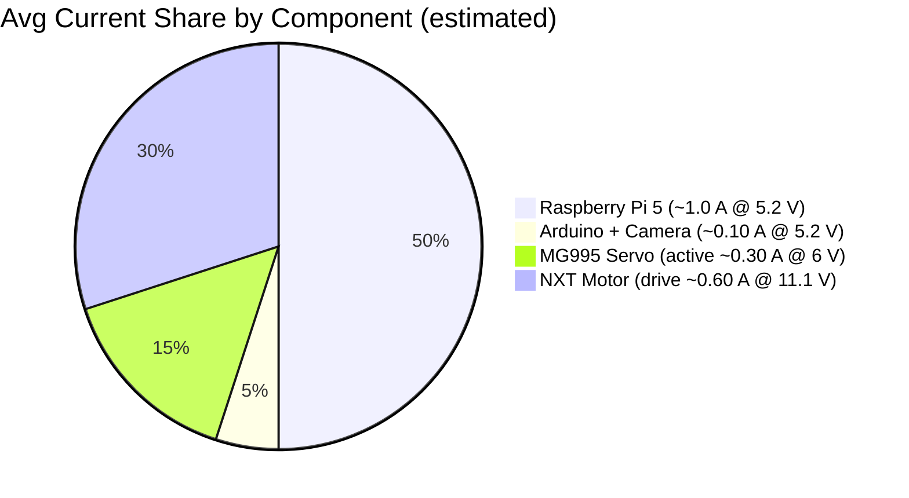

---

# Electrical and Electronic report – Team Rulo Bot

The electrical and electronic system of **Team Rulo Bot** is designed to provide stable power delivery, high-performance control, and reliable signal communication between all robot subsystems. This architecture supports **real-time vision**, **Ackermann steering**, and **precise traction control** during the **WRO Future Engineers 2025** competition.

The backbone of the system is a **3S 11.1 V LiPo battery**, which feeds a **main power switch** and then distributes power through three **Mini360** buck converters:

* **5.2 V rail** → Raspberry Pi 5 + Arduino Nano + peripherals
* **6.0 V rail** → MG995 servo (steering)
* **11.1 V rail (direct)** → DRV8871 motor driver (traction motor)

This configuration ensures stable operation of each subsystem while isolating high-load actuators from sensitive logic components. **All communication and sensor signals share a common star-ground reference** to minimize electrical noise. The design emphasizes a **clean separation of power domains** (logic vs. steering vs. drive), **low-latency control** between compute and I/O, and **simple, modular wiring**.

**Rationale:** Isolating the 6 V servo rail (with its own regulator) and using a local output capacitor mitigated the MG995’s transient noise that caused early resets in the logic domain. Meanwhile, the 11.1 V traction path remains independent of logic, preventing motor draw from browning out the computer. The result is a **noise-resistant architecture** where each power domain is buffered from the others.

---

## 1) System Architecture Summary

**Design focus:** Provide dedicated power and signal paths for each major function, and ensure low interference between them. The battery’s output is split into regulated rails tailored to each component’s needs, preventing cross-coupling of noise. High-speed data (camera feed) is carried by USB 3.0, control commands go over a robust UART link, and actuators are driven with clean PWM signals. **All grounds meet at a single point (star ground)** near the power distribution to avoid ground loops or voltage drops between subsystems.

**Signal strategy:**

* **USB 3.0** for the camera (high bandwidth, low latency video streaming)
* **UART serial** between Raspberry Pi and Arduino (for real-time command and telemetry exchange)
* **PWM** signals from Arduino to servo and motor driver (for precise actuator control)
* **Encoder feedback** from the traction motor to the Arduino (for closed-loop speed/distance measurement)

All signal lines reference the common star-ground to maintain a stable baseline and reduce noise coupling. The result is a control architecture that is both **high-performance** and **noise-robust**, critical for real-time vision processing and responsive actuation.

---

## 2) Main Control Units

### Raspberry Pi 5 — Main Processor

The Raspberry Pi 5 was selected as the brain of the robot thanks to its:

* Quad-core ARM Cortex-A76 CPU @ 2.4 GHz and up to 8 GB RAM (providing ample processing power for vision algorithms and navigation logic).
* Excellent USB 3.0 support for the vision system (ensures high frame-rate camera input with minimal lag).
* Reliable UART serial interface for communicating with the Arduino Nano.
* Modern GPU and acceleration features that could assist with image processing if needed.

Powered from the **5.2 V Mini360** regulator rail, the Pi handles the UVC camera feed, runs real-time image processing and decision-making algorithms, and transmits low-latency control signals to the Arduino Nano. The regulator is set slightly above 5.0 V (at ~5.2 V) to account for wiring drops and ensure the Pi receives a stable 5 V under peak load. The Pi’s strong I/O capabilities and high compute throughput make it the centerpiece of the control architecture.

**Interfaces used:**

* **USB 3.0:** for the Innomaker camera (streaming 1080p @ 30 FPS video to the Pi for processing).
* **UART (serial):** for bidirectional communication with the Arduino Nano (sending steering/motor commands and receiving sensor/encoder data and alerts).

**Note:** Proper boot-up and shutdown procedures are followed to protect the Raspberry Pi’s filesystem. The main switch should only be turned off after the Pi’s program has stopped (and ideally the OS has been halted) to avoid SD card corruption.

---

### Arduino Nano — Auxiliary Microcontroller

The Arduino Nano acts as an intelligent I/O co-processor, handling time-critical and low-level tasks that complement the Pi’s high-level processing. **Key roles of the Nano include:**

* Reading the LEGO NXT motor’s encoder pulses with interrupt-level timing, providing precise measurement of wheel rotation (360 counts per revolution) without burdening the Pi.
* Generating stable PWM signals for the MG995 steering servo (typically 50 Hz control signal, ensuring smooth steering control).
* Monitoring the battery voltage via an analog input (through a resistor divider) and communicating alerts to the Pi (or visual indicators) if the voltage falls below safe levels.
* Driving the DRV8871 motor driver control pins (PWM for speed and a digital output for direction).

The Nano was chosen for its compact form factor, low power consumption, and ease of programming. It is powered from the same stable **5.2 V logic rail** as the Pi. By offloading tasks like encoder counting and direct hardware control to the Nano (which operates in real-time on a simple microcontroller), the Raspberry Pi is freed to focus on higher-level vision and planning.

This two-tier architecture (Linux computer + microcontroller) yields a responsive system:

* The interrupt-driven encoder reading on the Nano allows precise tracking of wheel speed and distance for odometry and traction control, even when the Pi is busy.
* The Nano can enforce low-level safety checks (for example, stopping the motor if a command is out of safe range or if battery is too low) and then inform the Pi, providing a layer of protection.
* Development and iteration are fast – the Nano’s firmware can be updated quickly via USB, and its simplicity means it boots almost instantly, ready to interface with the Pi.

**I/O summary:**

* **Serial UART:** communication with Raspberry Pi (e.g., receiving target steering angle and speed, sending back encoder counts and battery voltage status).
* **Digital/PWM outputs:** controlling the MG995 servo (steering angle) and the DRV8871 driver (motor speed/direction).
* **Digital inputs (interrupts):** from the quadrature encoder of the NXT motor for measuring wheel rotations.
* **Analog input:** reading battery voltage through a voltage divider for low-battery detection.

---

## 3) Vision System

### Innomaker UVC 2.0 Camera

The Innomaker UVC 2.0 Camera is a plug-and-play USB module chosen as the robot’s vision sensor due to its:

* **Wide 103° field of view (FOV)**, ideal for capturing the robot’s surroundings including nearby walls and upright obstacle pillars in the competition field. This wide-angle lens allows the robot to perceive both forward and peripheral obstacles, improving situational awareness for navigation.
* **Full HD 1080p @ 30 FPS** video streaming over USB 3.0. The high resolution and frame rate enable the Raspberry Pi to detect and track features in real-time with clarity.
* **UVC compliance (USB Video Class)**, meaning it works with standard drivers out-of-the-box on Raspberry Pi OS — no custom drivers needed, simplifying setup.
* **Low power consumption (~0.25 W)**, which is negligible on the 5 V rail and generates minimal heat.

This camera serves as the primary (and only) environmental sensor on the robot. There are **no ultrasonic or infrared range sensors installed**; all obstacle detection and navigation cues come from vision processing. By relying entirely on the camera feed for perception, the system is simplified and focuses on vision-based algorithms to interpret the course (for example, detecting lines, walls, and color markers).

**Placement:** The camera is mounted at a fixed angle providing a clear view of the path ahead. It connects to the Raspberry Pi 5 via a short USB 3.0 cable. In testing, the camera’s broad FOV proved advantageous in tight course sections, as it could see boundary walls on either side simultaneously, helping the software make informed steering decisions.

---

## 4) Actuation System

### MG995 Servo — Ackermann Steering

The Tower Pro MG995 Servo is used to actuate the front steering linkage (Ackermann steering mechanism). It was selected for its combination of high torque and fast response:

* **Stall torque ~10–11 kg·cm @ 6.0 V**, sufficient to turn the robot’s wheels under load.
* **Speed ~0.16 s/60° @ 6.0 V**, enabling agile maneuvers and quick corrections.
* **Metal geartrain** and sturdy build for durability.

The servo is powered from a dedicated **6.0 V Mini360** buck converter output. By giving the servo its own regulated supply, any large current draw or voltage dip from the servo will not directly affect the logic circuitry.

**Noise/EMI mitigation (implemented):**

* A **47 µF electrolytic capacitor** is placed at the output of the 6 V regulator (close to the servo’s supply line). This local decoupling capacitor provides a small energy reservoir right next to the servo, which helps to smooth out rapid current spikes and filter high-frequency noise generated by the servo’s motor.
* Thanks to this capacitor (and the separate supply), during testing the random resets and control signal glitches we initially observed (when the servo turned quickly) were completely resolved.

Overall, the MG995 now delivers sharp and precise steering under load without any brownouts or interference to the rest of the system. The steering linkage is configured for **Ackermann geometry**, so the inside wheel turns slightly more than the outside wheel during a turn, improving maneuverability.

---

### LEGO NXT Motor with Encoder — Traction

For the drive/traction, the robot uses a **LEGO NXT Motor (P/N 9842)**, a DC motor with an integrated encoder and gearbox:

* Nominal **9 V** operation; in this robot it is driven at **up to 11.1 V** from the LiPo battery through PWM control.
* Internally geared to about **170 RPM no-load @ 9 V** (~180–200+ RPM @ 11.1 V no-load).
* Built-in **quadrature encoder (360 counts/rev)** of the output shaft (≈1 count/degree).

The NXT motor’s integrated gearbox and encoder made it an attractive choice: robust, self-contained, and reliable. Feedback enables precise traction control (speed regulation, slip detection, accurate distance moves).

**Important note:** Running above nominal voltage (11.1 V vs 9 V) was tested carefully. Typical draw **0.2–0.6 A**, spikes up to **~2 A** on acceleration or stall. The DRV8871 driver and battery can handle these spikes. Continuous stalling at 11.1 V is avoided to prevent overheating; in practice the motor remained within safe temperature limits due to short duty cycles and driver current limiting.

---

## 5) Power Electronics

### DRV8871 Motor Driver (for Traction Motor)

The **DRV8871** is a compact single-channel DC motor driver module powering the NXT traction motor directly from the battery’s **11.1 V** line. It was selected because:

* Wide voltage range (up to **45 V**) and **3.6 A peak**, covering the motor’s needs with margin.
* Built-in protections: **UVLO**, **OCP**, and **TSD**.
* Very compact and light; can be mounted near the motor to minimize high-current wire length.

Controlled by the Arduino Nano (PWM for speed + DIR for polarity). The driver’s **current limiting** protects motor and battery without external fuses/sensors. Proximal mounting reduces voltage drop and EMI.

---

### Mini360 Buck Converters (Regulators) + Output Filtering

The **Mini360** buck converters (MP2307) create the needed rails from **11.1 V LiPo**:

* **5.2 V** for Raspberry Pi 5, Arduino Nano, and 5 V peripherals (USB camera).
* **6.0 V** dedicated to the MG995 steering servo.
* **11.1 V direct** serves the DRV8871 (traction).

These modules are ~17×11 mm, efficient (~95%), and handle ≈1.8 A continuous. The 5.2 V line is chosen to ensure the Pi sees ≥5.0 V at load. The **6.0 V** servo rail has a **47 µF** electrolytic capacitor **at the output** for local smoothing (eliminated resets/glitches).

**Mounting:** Inline with the harness, soldered and heat-shrunk. This reduces rail length, saves space/weight, and keeps regulators close to loads.

---

### Ovonic 3S 11.1 V 5200 mAh LiPo Battery

The **Ovonic 3S 11.1 V 5200 mAh** LiPo is the main energy source, selected for:

* **High capacity (5200 mAh)** → ample runtime across rounds and development.
* **High discharge capability** → handles motor/servo spikes with low sag.
* **Stable voltage curve** (~12.6 V full → ~11.1 V nominal → ~9.6 V near empty).

Battery connects to a master **power switch**. 

---

## 6) Power Topology

* The main power switch controls the entire power distribution; when ON, **11.1 V** feeds the bus; buck converters derive **5.2 V** and **6.0 V** rails.
* Independently regulated rails greatly improve stability (noisy/high-current loads are separated from sensitive logic).
* **47 µF** on the servo’s **6 V** rail filters transients.
* **Star grounding**: all returns converge at a single node near battery negative; minimizes loops/ground-bounce.
* Modular distribution eases isolation and diagnostics.

---

## 7) Signal Integrity & EMI Practices

Several best practices were implemented to ensure signal integrity and reduce electromagnetic interference (EMI):

* **Power Domain Isolation:** Logic (Pi, Nano, camera) on 5.2 V; servo on its own 6.0 V; drive motor on 11.1 V.
* **Local Decoupling Capacitors:** 47 µF on the 6 V servo line; standard decoupling present on Pi/Nano inputs.
* **Star Grounding:** Single-point ground node.
* **Short, Bundled Wiring:** Short runs, careful routing, twisted pairs where beneficial.
* **Proper Signal Leveling:** Pi (3.3 V) ↔ Nano (5 V) UART link operates reliably at short distance; future designs may use a level shifter or 3.3 V MCU.

**Result:** The combination of isolated rails and filtering eliminated early resets and noise issues; communications and sensing remain stable during operation.

---

## 8) Operating Procedure

**Power-on:**

1. Verify main power **OFF**; check connections and polarity.
2. Connect LiPo.
3. Switch main power **ON** (5.2/6.0 V rails energize; Pi boots; Nano starts).
4. Wait for Pi boot.

**Pre-run checks:**

* **Steering test:** center linkage; command servo lock-to-lock; observe smooth behavior, no resets.
* **Drive test (wheel lifted):** command small motion; check DRV8871 temperature and battery sag.
* **Encoder feedback:** spin wheel by hand; verify counts and direction.
* **Communication:** verify UART roundtrip.

**Run (during operation):**

* Start main control program on the Pi; observe steering and throttle responses; monitor battery voltage; use main power switch for emergency stop if needed.

**Shutdown:**

1. Stop the program; ideally issue OS shutdown on Pi.
2. Toggle main power **OFF**.
3. Disconnect battery for storage; store LiPo at safe voltage.
4. Inspect for heat/loose wires.

---

## 9) Protection & Safety Measures

* **Battery Monitoring:** Nano reads LiPo voltage; warns on low level.
* **Current Limiting (DRV8871):** Protects motor/battery from overload.
* **Independent Servo Rail:** Servo surges do not brown-out logic.
* **Star Ground & Decoupling:** Reduces erratic behavior from noise.
* **Main Kill Switch:** Fast global cut-off (fuse considered for future).
* **Thermal Considerations:** DRV8871 and Mini360 verified within normal temperature rise; Pi 5 uses a small heatsink.

---

## 10) Power Budget

Below is a summary of the power budget for the robot, listing each major component, its supply voltage, typical current draw, peak current draw, and any relevant notes:

| Component       | Voltage | Avg Current (A) | Peak Current (A) | Notes                                                                                  |
| --------------- | ------: | --------------: | ---------------: | -------------------------------------------------------------------------------------- |
| Raspberry Pi 5  |   5.2 V |            ~1.0 |              2–3 | Main processor (vision & navigation logic). Higher peaks if CPU/GPU fully used.        |
| Arduino Nano    |   5.2 V |           ~0.05 |            ~0.05 | Auxiliary microcontroller (nearly negligible draw).                                    |
| UVC Camera      |   5.2 V |           ~0.05 |            ~0.05 | Innomaker wide-angle camera (low-power device).                                        |
| MG995 Servo     |   6.0 V |        0.1–0.3* |             ~2.0 | Steering servo. Avg depends on motion load; idle ~0.1 A, active ~0.3–0.5 A.            |
| NXT Drive Motor |  11.1 V |         0.2–0.6 |             ~2.0 | Traction motor; peaks on acceleration or stall.                                        |
| DRV8871 Driver  |  11.1 V |           <0.01 |     (self-limit) | Quiescent very low; limits motor current ~3.6 A max.                                   |
| Ovonic 3S LiPo  |  11.1 V |               — |                — | Battery can supply >100 A bursts if shorted; our usage peaks <~5 A. 5200 mAh capacity. |

* The servo’s “Avg Current” varies widely based on usage; ~0.1–0.3 A is a mid-range estimate.

From the above, **typical total draw ≈ 2–3 A average** (battery side; note conversion efficiencies). Plenty of headroom for regulators and wiring.

**Illustrative current distribution (approximate):**

Sizing checks:

* **5.2 V** regulator ≈1.1 A typical (Pi+Nano+camera) → within ~1.5–2 A capacity.
* **6.0 V** regulator (servo) → avg few hundred mA, tolerates 1–2 A bursts with local cap.
* Battery and wiring/connectors (>10 A rated) → ample margin.

---

## 11) Conclusion

The electrical system of **Team Rulo Bot** has been carefully designed and refined to maximize performance, stability, and noise immunity, which are all crucial for a successful autonomous robot in competition:

* The **Raspberry Pi 5** serves as a powerful central processor, handling demanding real-time vision tasks and high-level decision making.
* The **Arduino Nano** provides fast, deterministic control of hardware (sensors and actuators) and safeguards the system with low-level monitoring, creating a robust two-layer control scheme.
* The **Innomaker UVC camera** offers wide-angle vision, allowing the robot to perceive its environment fully using vision alone, simplifying the sensor suite and focusing efforts on camera-based algorithms.
* The **MG995 servo** and **NXT motor** (driven by the DRV8871) together deliver responsive steering and reliable drive power. Their dedicated power supplies and feedback mechanisms (encoder for the motor) mean the robot can maneuver precisely and with confidence in its movements.
* The power distribution (via **Mini360 buck converters** and a high-capacity **LiPo** battery) provides clean and adequate power to all components.
* Critical issues encountered early, such as voltage dips from the servo causing resets, were solved by hardware fixes (like the addition of the **47 µF** capacitor and isolating the servo’s supply).
* The result is a system that can operate under competition stress — rapid movements, continuous vision processing, and potential electrical noise — without compromising reliability or performance.

In summary, the electrical and electronic design is **optimized for competition use**, emphasizing **reliability, safety, and ease of maintenance**. The separation of concerns (power and control), along with thoughtful integration of components, provides a strong foundation for **WRO Future Engineers 2025** and beyond.

---

## 12) References

* **Tower Pro MG995 Datasheet** — sandorobotics.com.mx
* **DRV8871 Motor Driver – TI (Texas Instruments) datasheet** — ti.com
* **LEGO NXT Motor (9842) Reference** — lagos.udg.mx
* **Mini360 Buck Converter (MP2307)** — components101.com
* **Raspberry Pi (Power Requirements and Best Practices)** — forums.raspberrypi.com
* **UVC Camera Module Specs (Innomaker)** — spanish.module-camera.com
* **Ovonic LiPo Battery (11.1 V 5200 mAh)** — dynamoelectronics.com

---

